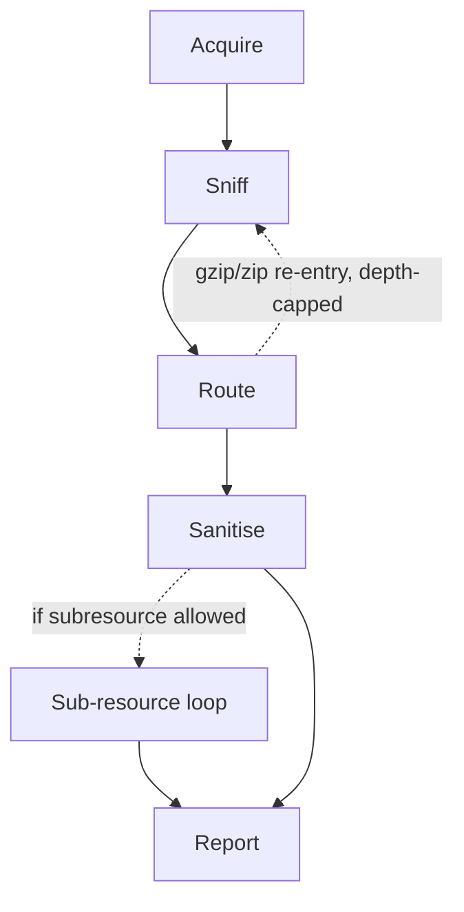
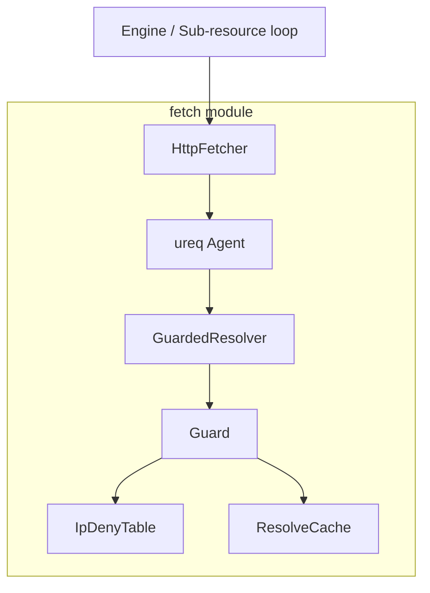

# Architectural Decisions

## 3.1 The pipeline

Every input, regardless of source, goes through the same five-stage pipeline,
implemented in `src/engine/mod.rs` and `src/engine/route.rs`:



- **Acquire** reads bytes from a file, from an in-memory `Bytes` input, or performs the initial HTTP fetch for a URL input, under the input-bytes budget.
- **Sniff** (`src/sniff/mod.rs`) classifies the real MIME type from a table of magic numbers, and compares it against the declared `Content-Type`. On mismatch, the sniffed type wins and the mismatch itself is recorded as an action.
- **Route** (`src/engine/route.rs`) dispatches on the sniffed type to the right handler:
  - `html::sanitize_html` for HTML;
  - entity-expansion scanning for XML/SVG;
  - header-only dimension checks for images;
  - bounded inflate + re-sniff for gzip;
  - byte-identical pass-through for everything else.
  - This is also where **type-specific budgets** are applied.
- **Sanitise** produces the rewritten bytes plus a list of `SanitisationAction`s.
- **Sub-resource loop** (`src/engine/subresource.rs`, opt-in via policy) resolves the references an HTML sanitisation pass collected, fetches them under a joint budget, and recurses the whole pipeline on each one.
- **Report** (`src/report.rs`) assembles a JSON document combining a per-run summary and a per-input report tree (including sub-resources).

## 3.2 Policy

Which rule fires, what action it takes (`Remove`, `Placeholder`, `Rewrite`, `Refuse`, `Allow`), every numeric budget is a field of `Policy` (`src/policy/mod.rs`), loaded from a compiled-in default and optionally overridden by a TOML file. Two choices are important to mention:

- **`#[serde(deny_unknown_fields)]`** on every policy struct. A typoed policy that silently does nothing is worse than a crash, and this change is a strong guarantee against silently-permissive misconfiguration.
- **Policy compiles into runtime structures once, at `Engine::new`, not on the hot path.** Block-lists compile into a `BlockSet`, protected domains compile into a `SkeletonSet` (used for homograph detection), and SSRF rules compile into a `Guard` with its own deny table. A malformed block-list or CIDR is a `ConfigError` raised before any input is touched. This also means the compiled structures can be wrapped in `Arc` and shared read-only across every worker thread without per-input recompilation cost.

`Policy` itself is a struct of structs and each section is independently overridable from TOML, with untouched sections falling back to their own `Default` implementation.

### 3.2.1 `Action`

Every rule across every section resolves to one of five outcomes, defined once and reused everywhere:

```rust
pub enum Action {
    Remove,       // delete the offending construct entirely
    Placeholder,  // replace it with a fixed, inert stand-in
    Rewrite,      // replace it with a policy-supplied safe value
    Refuse,       // abort sanitisation of this input outright
    Allow,        // let it through unchanged (an explicit opt-out)
}
```

### 3.2.2 `HtmlRules`

```rust
pub struct HtmlRules {
    pub script_allowlist: Vec<String>,        // origins allowed for <script src>
    pub frame_origin_allowlist: Vec<String>,  // origins allowed for <iframe>/<object>/<embed>
    pub action_script: Action,                // default: Remove
    pub action_event_handler: Action,         // default: Remove
    pub action_dangerous_scheme: Action,      // default: Rewrite
    pub action_frame: Action,                 // default: Placeholder
    pub action_meta_refresh: Action,          // default: Remove
    pub placeholder_frame: String,            // markup substituted when action_frame = Placeholder
}
```

Each `action_*` field maps directly onto one bullet of requirement, each get their own independently configurable response, rather than one global action.
The two allow-lists (`script_allowlist` `frame_origin_allowlist`) are the escape hatch for legitimate use  without disabling script removal globally.

### 3.2.3 `UrlRules`

```rust
pub struct UrlRules {
    pub blocklists: Vec<PathBuf>,          // hosts-style block-list files, compiled at engine start
    pub protected_domains: Vec<String>,    // domains checked for homograph confusables
    pub action_blocked: Action,            // default: Rewrite
    pub action_homograph: Action,          // default: Rewrite
    pub placeholder_url: String,           // default: "#blocked"
}
```

This maps onto requirement F4: `blocklists` is the list of dangerous blocked hosts, `protected_domains` is the list of domains whose homographs we want to detect.

### 3.2.4 `Budgets`

```rust
pub struct Budgets {
    pub max_input_bytes: u64,        // default: 10 MiB
    pub max_time_ms: u64,            // default: 10,000 ms
    pub max_decompress_ratio: u32,   // default: 10×
    pub max_entity_expansions: u32,  // default: 1,000
    pub max_image_pixels: u64,       // default: 50,000,000
}
```

Budgets limits bytes and time for each resource:

- `max_input_bytes` bounds the Acquire stage before anything is parsed at all;
- `max_time_ms` is the overall per-input wall-clock ceiling that makes the pipeline degrade gracefully rather than hang;
- `max_decompress_ratio` is the zip/gzip-bomb defence, giving a maximum ratio between compressed and uncompressed sizes;
- `max_entity_expansions` is the billion-laughs defence for XML/SVG;
- `max_image_pixels` catches a pixel-flood image (small file, enormous decoded dimensions) before decoding it fully.

`route.rs` is the module that knows which budget applies to which type.

### 3.2.5 `FetchPolicy`

```rust
pub struct FetchPolicy {
    pub connect_timeout_ms: u64,    // default: 5,000 ms
    pub read_timeout_ms: u64,       // default: 5,000 ms
    pub total_timeout_ms: u64,      // default: 30,000 ms
    pub redirect_limit: u32,        // default: 5
    pub max_response_bytes: u64,    // default: 10 MiB
    pub user_agent: String,         // default: "web-sanitizer/<version>"
}
```

The three timeouts allow for identification of Slowloris-like attacks, and `redirect_limit` blocks redirect chains over the selected cap. `max_response_bytes` is the budget for fetched content.

### 3.2.6 `InputRules` — what a directory walk picks up

```rust
pub struct InputRules {
    pub extensions: Vec<String>,  // default: ["html", "htm"]
}
```

InputRules simply decides what extensions are given to the pipeline.

### 3.2.7 `SubresourcesRules` — the optional fetch-and-recurse loop

```rust
pub struct SubresourcesRules {
    pub fetch_subresources: bool,           // default: false — opt-in only
    pub max_depth: u32,                     // default: 1
    pub max_requests: u32,                  // default: 32
    pub max_total_bytes: u64,               // default: 50 MiB
    pub types: Vec<SubresourceType>,        // default: [Css, Js, Image]
    pub sniff_rule: SniffAction,            // default: Reject
    pub active_content_rule: ActiveContentAction, // default: Reject
    pub zip_budget: ZipBudgets,
    pub xml_budget: XmlBudgets,
    pub dos_risk_rule: DosDetectedAction,   // default: Reject
    pub rewrite_refs: bool,                 // default: true
    pub action_refused: Action,             // default: Rewrite
}
```

This section covers everything regarding subresources:

- `fetch_subresources` decides whether subresource fetching is allowed or not;
- `max_depth`, `max_requests`, and `max_total_bytes` define the subresource budgets
- `types` whitelists which *sniffed* types are eligible for fetching at all, and `sniff_rule`/`active_content_rule`/`dos_risk_rule` each independently decide what happens when a fetched sub-resource turns out to lie about its type, contain active content, or trip a nested budget.
- `zip_budget` and `xml_budget` are the nested budgets when a subresource is discovered to be a zip or xml.
- `rewrite_refs` and `action_refused` decide what happens to the references once they are sanitised or refused.

```rust
pub struct ZipBudgets {
    pub max_compression_ratio: f64,        // default: 100×
    pub max_total_uncompressed_bytes: u64, // default: 1 GiB
    pub max_entry_count: u32,              // default: 10,000
}

pub struct XmlBudgets {
    pub max_entity_depth: u32,     // default: 20
    pub max_expanded_size: u64,    // default: 10 MiB
    pub max_entity_count: u32,     // default: 10,000
}
```

These 2 budgets provide stricter rules for both Zip and XML.

### 3.2.8 `SsrfRules` — scope and exemptions for the network guard

```rust
pub struct SsrfRules {
    pub guard_input_urls: GuardScope,  // default: Server
    pub same_origin_exemption: bool,   // default: true
    pub allow_hosts: Vec<String>,      // default: empty
    pub deny_extra: Vec<String>,       // default: empty
    pub allow_ttl_ms: u64,             // default: 30,000 ms
}
```

The rules defined for SSRF protection.
`guard_input_urls` defines where and when the protection is applied, and the rest provides bypasses to certain urls, be it both as directly allowing them or immediately denying.
`allow_ttl_ms` defines how long a host is trusted after it is allowed.

## 3.3 Why `lol_html`

`sanitize_html` is built on `lol_html`, a streaming HTML tokenizer/rewriter, instead of a DOM-based library. This is mostly for 2 reasons:

1. **Bounded memory under adversarial input.**
  A streaming pass never materialises the whole document tree, so memory use tracks input size linearly rather than depending on document structure (e.g. deeply nested elements cannot blow up memory the way they could with some DOM parsers).
2. **Correctness across read boundaries.** A `<script>` tag split across a chunk boundary is still caught, because the tokenizer's state persists across chunks; a naive line-by-line or chunk-by-chunk regex approach would not have this property.

The cost is architectural too: because there is no tree, `sanitize_html` cannot ask cross-element questions. Instead the design uses a single flat handler (`element!("*", ...)`) invoked once per element, with a shared `Ctx` accumulating actions, refusal state, and collected references as a side effect of each per-element callback.
Input is fed to the rewriter as raw bytes, never via `rewrite_str`, specifically so that malformed or non-UTF-8 input degrades to a refusal instead of a panic.

## 3.4 Why the fetch/guard split

`src/fetch/mod.rs` is the only module in the crate that opens a socket. The SSRF guard (`src/fetch/guard/`) is layered *underneath* the HTTP client rather than as a check the caller remembers to run before calling it:



`GuardedResolver` implements `ureq`'s `Resolver` trait, so the SSRF check happens as part of DNS resolution itself, inside the transport the HTTP agent was constructed with.
Every caller funnels through the same `Agent`, so there is structurally no code path that can"forget" to guard a request. Opening a socket already checks the host.
The `FetchContext`/`FetchOrigin` types additionally let the guard apply different scopes (`InputCli`, `InputServer`, `Subresource`) and a same-origin exemption for a sub-resource served by its parent's already-vetted endpoint, without any of that policy logic leaking into the fetcher itself.

## 3.5 Module boundaries

| Module | Responsibility | Notably does *not* do |
| --- | --- | --- |
| `input` | Turn CLI args / `--input-list` into an ordered `Vec<InputSource>`; walk directories, filter by extension, refuse symlinks that escape the tree root. | Any I/O on the input's *content*. |
| `sniff` | Bytes → `MimeType`, reconciled against declared type. | Sanitisation. |
| `engine::route` | Type → handler dispatch, type-specific budget enforcement. | Knowing *how* to sanitise any given type. |
| `html` | HTML/attribute-level rule application, URL-attribute delegation to `urlcheck`. | Fetching, SSRF policy. |
| `urlcheck` | Block-list / homograph / malformed-host classification for a single URL, with its own verdict cache. | Sanitising HTML around the URL. |
| `fetch` + `fetch::guard` | The only socket-opening code path; SSRF enforcement. | Sanitisation, sniffing. |
| `scan` | Structural risk scanning (entity expansion, zip/decompress ratio, PDF/TIFF active-content indicators). | HTML rule enforcement. |
| `policy` | Declarative configuration schema, compiled artefacts (`BlockSet`, `SkeletonSet`). | Applying the policy itself. |
| `report` | The JSON report schema and its assembly helpers. | Deciding *what* goes in a report. |
| `engine` | Orchestration: wires every module above into the five-stage pipeline, owns the worker pool. | Format-specific logic. |

This pipeline, having `engine` as the module that orchestrates all the different format-specific modules (without having any knowledge itself) allows for each module to be tested in isolation, to check its how effective it is in its own domain.

## 3.6 Four-layer architecture

The module separation follows also the proposed architecture in the project specifications:

| Suggested layer | Realised as |
| --- | --- |
| Input layer (local files, directory trees, remote fetches) | `input` () + `fetch`/`fetch::guard` |
| Parsing layer (safe HTML parser) | `html` + `sniff` |
| Core engine (policy-driven rule sequencing, scheduler, report aggregation) | `engine` + `policy` + `report` |
| CLI front-end | `src/main.rs` + `src/args.rs`, calling only `Engine::process`/`process_batch` |

The only deviation from the architecture, is that the parsing layer is actually divided in two. `sniff` decides what a byte stream is, before a handler parses and sanitises it.
