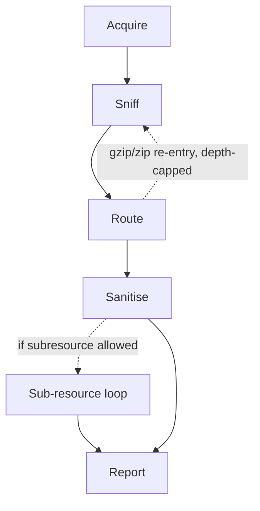
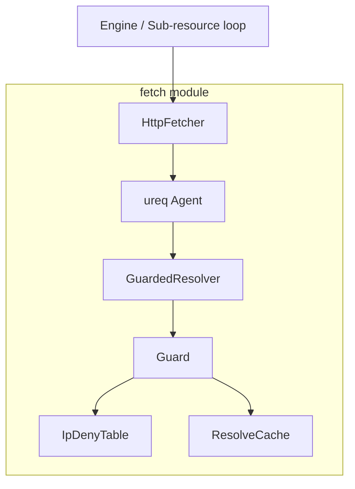

# Architectural Decisions

## 3.1 The pipeline

Every input, regardless of source, goes through the same five-stage pipeline, implemented in `src/engine/mod.rs` and `src/engine/route.rs`:

- **Acquire** reads bytes from a file, from an in-memory `Bytes` input, or performs the initial HTTP fetch for a URL input, under the input-bytes budget.
- **Sniff** (`src/sniff/mod.rs`) classifies the real MIME type from a table of magic numbers, and compares it against the declared `Content-Type`. On mismatch, the sniffed type wins and the mismatch itself is recorded as an action.
- **Route** (`src/engine/route.rs`) dispatches on the sniffed type to the right handler:
  - `html::sanitize_html` for HTML;
  - entity-expansion scanning for XML/SVG;
  - header-only dimension checks for images;
  - bounded inflate + re-sniff for gzip;
  - byte-identical pass-through for everything else;
  - This is also where **type-specific budgets** are applied.
- **Sanitise** produces the rewritten bytes plus a list of `SanitisationAction`s.
- **Sub-resource loop** (`src/engine/subresource.rs`, opt-in via policy) resolves the references an HTML sanitisation pass collected, fetches them under a joint budget, and recurses the whole pipeline on each one.
- **Report** (`src/report.rs`) assembles a JSON document combining a per-run summary and a per-input report tree (including sub-resources).

## 3.2 Policy

`Policy` is the single source of truth for sanitisation rules, actions, and resource limits. It is loaded from compiled-in defaults and can be overridden with TOML. All policy structs use `#[serde(deny_unknown_fields)]`, so configuration typos fail instead of silently weakening protection.

At `Engine::new`, block-lists, protected domains, and SSRF rules are compiled into reusable runtime structures. Invalid block-lists or CIDRs therefore fail before processing begins, and the compiled policy can be shared safely across workers.

Every rule resolves to one of five actions: `Remove`, `Placeholder`, `Rewrite`, `Refuse`, or `Allow`.

| Policy section | Controls |
| --- | --- |
| `HtmlRules` | Scripts, event handlers, dangerous URL schemes, frames, meta refresh, and their allow-lists |
| `UrlRules` | Host block-lists, protected domains, homograph detection, and URL replacements |
| `Budgets` | Input size, processing time, decompression ratio, entity expansions, and image dimensions |
| `FetchPolicy` | Connection/read/total timeouts, redirects, response size, and user agent |
| `InputRules` | File extensions included during directory walks |
| `SubresourcesRules` | Optional recursive fetching, depth/request/byte limits, allowed types, nested ZIP/XML limits, and reference rewriting |
| `SsrfRules` | Guard scope, same-origin exemptions, allowed or denied hosts, and allow-cache lifetime |

Each section is independently configurable; omitted sections retain their defaults. Format-specific code consumes the compiled policy but does not define policy values itself.

## 3.3 Why `lol_html`

`sanitize_html` is built on `lol_html`, a streaming HTML tokenizer/rewriter, instead of a DOM-based library. This is mostly for 2 reasons:

1. **Bounded memory under adversarial input.**
  A streaming pass never materialises the whole document tree, so memory use tracks input size linearly rather than depending on document structure (e.g. deeply nested elements cannot blow up memory the way they could with some DOM parsers).
2. **Correctness across read boundaries.** A `<script>` tag split across a chunk boundary is still caught, because the tokenizer's state persists across chunks; a naive line-by-line or chunk-by-chunk regex approach would not have this property.

The cost is architectural too: because there is no tree, `sanitize_html` cannot ask cross-element questions. Instead the design uses a single flat handler (`element!("*", ...)`) invoked once per element, with a shared `Ctx` accumulating actions, refusal state, and collected references as a side effect of each per-element callback.
Input is fed to the rewriter as raw bytes, never via `rewrite_str`, specifically so that malformed or non-UTF-8 input degrades to a refusal instead of a panic.

## 3.4 Why the fetch/guard split

`src/fetch/mod.rs` is the only module in the crate that opens a socket. The SSRF guard (`src/fetch/guard/`) is layered *underneath* the HTTP client rather than as a check the caller remembers to run before calling it:

`GuardedResolver` implements `ureq`'s `Resolver` trait, so the SSRF check happens as part of DNS resolution itself, inside the transport the HTTP agent was constructed with.
Every caller funnels through the same `Agent`, so there is structurally no code path that can "forget" to guard a request. Opening a socket already checks the host.
The `FetchContext`/`FetchOrigin` types additionally let the guard apply different scopes (`InputCli`, `InputServer`, `Subresource`) and a same-origin exemption for a sub-resource served by its parent's already-vetted endpoint, without any of that policy logic leaking into the fetcher itself.

## 3.5 Module boundaries

| Module | Responsibility | Notably does *not* do |
| --- | --- | --- |
| `input` | Turn CLI args / `--input-list` into an ordered `Vec<InputSource>`; walk directories, filter by extension, refuse symlinks that escape the tree root. | Any I/O on the input's *content*. |
| `sniff` | Bytes → `MimeType`, reconciled against declared type. | Sanitisation. |
| `engine::route` | Type → handler dispatch, type-specific budget enforcement. | Knowing *how* to sanitise any given type. |
| `html` | HTML/attribute-level rule application, URL-attribute delegation to `urlcheck`. | Fetching, SSRF policy. |
| `urlcheck` | Block-list / homograph / malformed-host classification for a single URL, with its own verdict cache. | Sanitising HTML around the URL. |
| `fetch` + `fetch::guard` | The only socket-opening code path; SSRF enforcement. | Sanitisation, sniffing. |
| `scan` | Structural risk scanning (entity expansion, zip/decompress ratio, PDF/TIFF active-content indicators). | HTML rule enforcement. |
| `policy` | Declarative configuration schema, compiled artefacts (`BlockSet`, `SkeletonSet`). | Applying the policy itself. |
| `report` | The JSON report schema and its assembly helpers. | Deciding *what* goes in a report. |
| `engine` | Orchestration: wires every module above into the five-stage pipeline, owns the worker pool. | Format-specific logic. |

This pipeline, having `engine` as the module that orchestrates all the different format-specific modules (without having any knowledge itself) allows for each module to be tested in isolation, to check how effective it is in its own domain.

## 3.6 Four-layer architecture

The module separation follows also the proposed architecture in the project specifications:

| Suggested layer | Realised as |
| --- | --- |
| Input layer (local files, directory trees, remote fetches) | `input` + `fetch`/`fetch::guard` |
| Parsing layer (safe HTML parser) | `html` + `sniff` |
| Core engine (policy-driven rule sequencing, scheduler, report aggregation) | `engine` + `policy` + `report` |
| CLI front-end | `src/main.rs` + `src/args.rs`, calling only `Engine::process`/`process_batch` |

The only deviation from the architecture, is that the parsing layer is actually divided in two. `sniff` decides what a byte stream is, before a handler parses and sanitises it.
