# Experimental Evaluation

## 5.1 Correctness

### 5.1.1 The corpus and ground truth

`corpus/benign` holds 41 real, unmodified pages pulled from the public web, `corpus/malicious` holds 41 samples (42 files, one of which, `blocklist.txt`, is supporting data rather than a sample) written specifically for this project, mostly by injecting a specific attack technique into the *same* real pages used in the benign set, so a detection result is a same-content, with/without-payload comparison rather than a comparison across unrelated documents.

Every sample is documented in `corpus/ground-truth.toml`: where it came from, its licence, what it's expected to carry, the rule IDs it must trigger (for malicious samples) or is *allowed* to trigger (for benign samples, since a rule can correctly fire even on those), and literal byte markers that must **not** survive sanitisation (`forbidden`) for malicious samples or must survive (`preserved`) for benign samples.

### 5.1.2 Verdict methodology

`xtask::correctness` classifies every sample into one of six verdicts:

| Verdict | Meaning |
| --- | --- |
| `Detected` | (malicious only) the sample reached an accepted status, every required rule fired, and no forbidden byte marker survived in the output |
| `Mislabelled` | (malicious only) the attack was neutralised (no leak, accepted status) but not by the rule the ground truth expected |
| `Missed` | (malicious only) neutralised but a required rule never fired, and nothing leaked |
| `Leaked` | (malicious only) a forbidden byte marker is still present in the sanitised output |
| `Clean` | (benign only) no unexpected/forbidden rule fired and no marker that should have survived was lost |
| `FalsePositive` | (benign only) either an unjustified rule fired, or content the sample explicitly expected to survive was removed |

`FalsePositive` on the benign side covers *both* directions of over-reach: a rule firing where nothing in that page justifies it, and a rule (correctly, per its own logic) removing something the ground truth says should have been preserved.

### 5.1.3 Results: detection by category

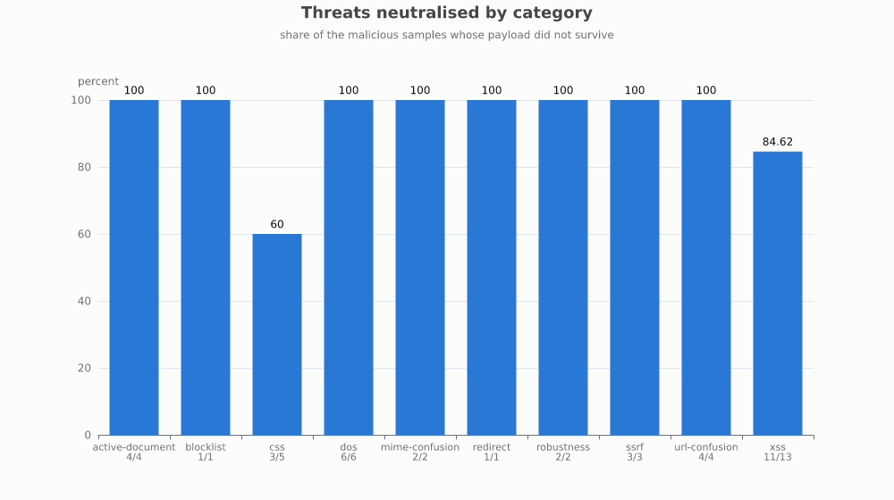

Across the 41 malicious samples, **37 were fully neutralised (90.2%)**. Eight of ten attack categories hit 100%: `active-document` (4/4), `blocklist` (1/1), `dos` (6/6), `mime-confusion` (2/2), `redirect` (1/1), `robustness` (2/2), `ssrf` (3/3), and `url-confusion` (4/4).

Two categories fell short of 100%:

- **`css`: 3/5 (60%)** - the weakest category in the corpus.
- **`xss`: 11/13 (84.6%)** - two samples not fully neutralised, out of the largest single category.

We can state thanks to this that the success rate was **90.2% overall, with `css` being the weakest section**.

## 5.2 Performance

### 5.2.1 Latency against input size

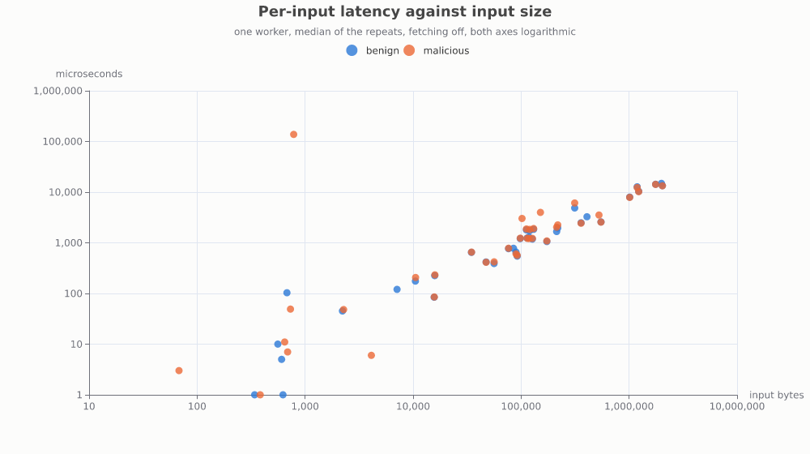

Measured with `cargo xtask latency`: one worker, median of 5 repeats, fetching off.
The relationship is close to linear on a log-log plot across nearly four orders of magnitude of input size (hundreds of bytes to low megabytes).
Benign and malicious latency track each other closely at matched sizes, with one visible outlier: a malicious sample around 700 bytes takes roughly 130ms.

### 5.2.2 Where the time goes

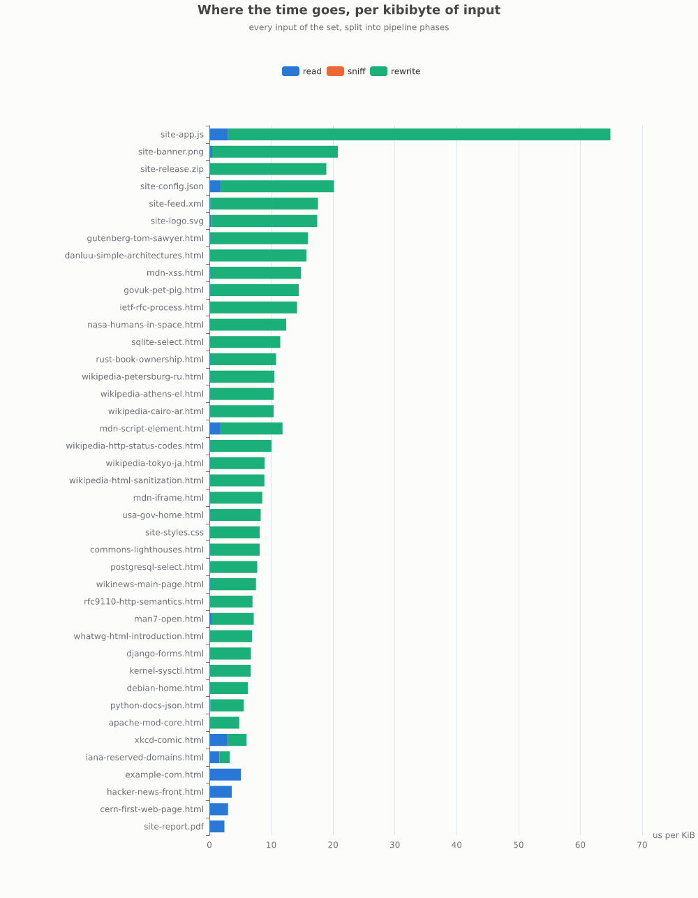

Measured with `cargo xtask phases`: each input split into `read` / `sniff` / `rewrite` phases, normalised to microseconds per kibibyte so inputs of different sizes are comparable.
For nearly every benign sample, `rewrite` dominates, with a handful of exceptions where `read` dominates instead: these are small files that the fixed per-call I/O overhead outweighs the amount of actual rewriting work.
`site-app.js` stands out as the highest per-KiB rewrite cost in the benign set by a wide margin.
Since JavaScript sub-resources are routed to the active-content scanner rather than the HTML rewriter, this is consistent with per-byte scanning being more expensive than HTML tag/attribute stripping.

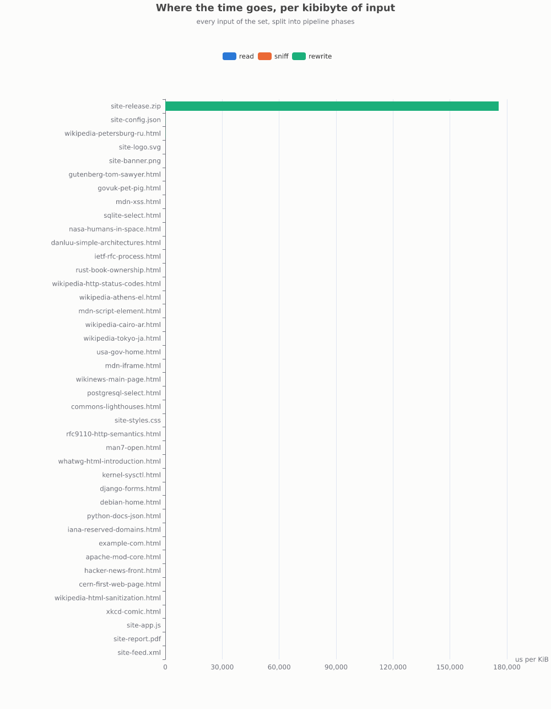

The malicious-corpus version of the same chart tells a sharper story: **`site-release.zip` costs roughly 175,000 µs/KiB, over 1000 times every other sample in the set**, which is otherwise not even visible on the same linear scale.
There's no clear explanation to why the zip takes so long, as it should be immediately refused once the ratio is considered exceeded, but this could also be caused by the cost of reading the central directory, compared also to the small size of zip files.

### 5.2.3 The cost of sub-resource fetching

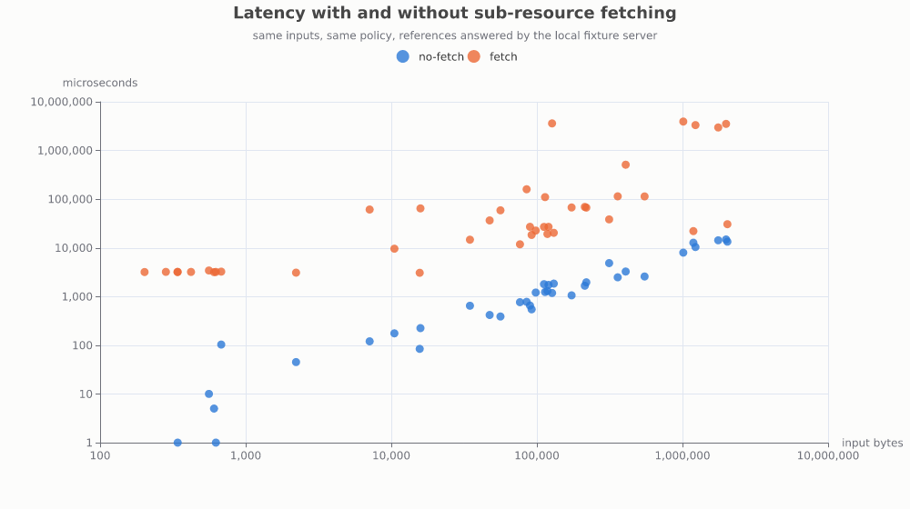

Every absolute reference in a fetched page is rewritten to point at an in-process fixture server rather than the open web, so the comparison isolates the sub-resource loop's own overhead from real-network variance.
The gap is substantial and consistent across the whole size range: fetch latency sits roughly two to three orders of magnitude above no-fetch latency for the same input.
A deployment turning on `subresources.fetch_subresources` should expect multi-millisecond, not sub-millisecond, per-input latency even against a fast, local origin.
The malicious-corpus version of this chart shows the same shape.

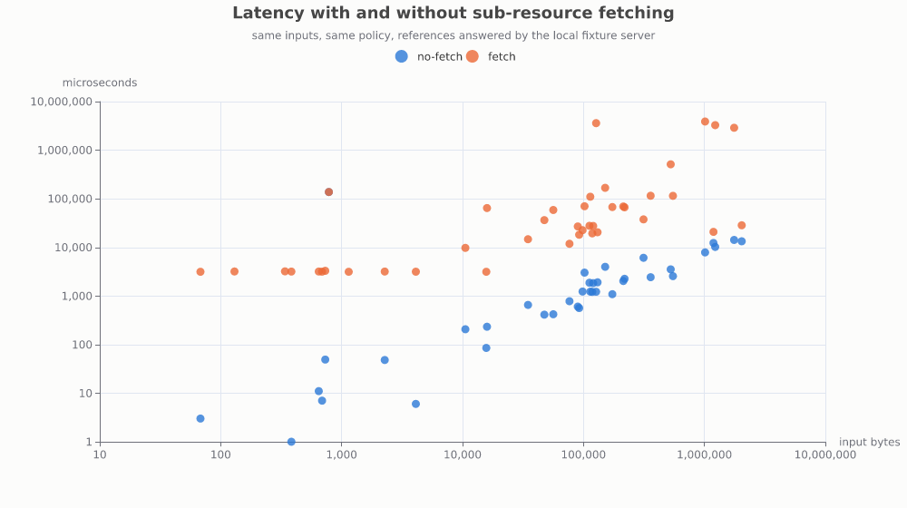

## 5.3 Scalability

**Benign**
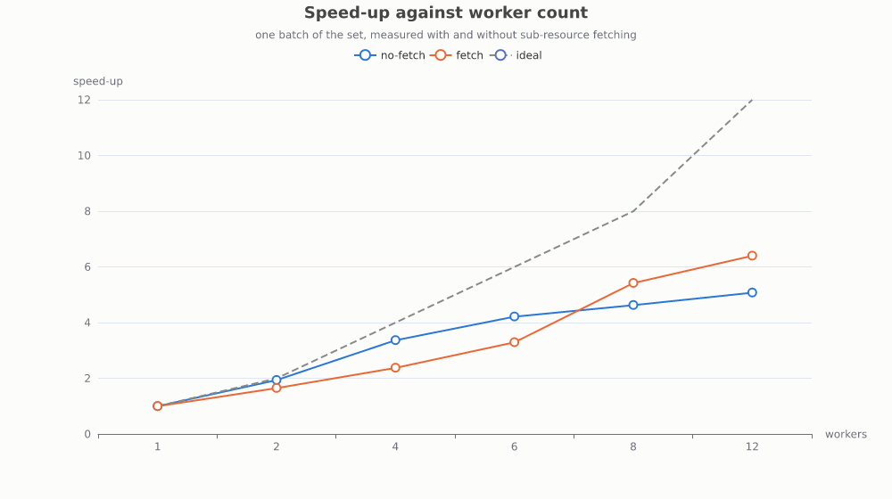

**Malicious**
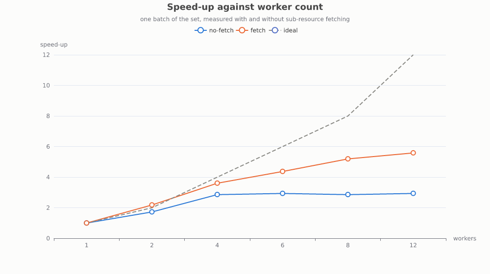

This is a benchmark sweeping `WORKERS = [1, 2, 4, 6, 8, 12]` over three cycles of the whole corpus, run separately for benign/malicious sets and fetch on/off.
This aims to show the impact of multi-threading over the sanitisation.

Two things worth noting in these curves:

- **Neither curve tracks the ideal linear line much past 2 workers.**
  No-fetch speed-up on the benign set reaches roughly 4.2× at 6 workers and only 5.1× at 12, below the ideal 12×.
  This might be either because of the `RwLock`-guarded verdict/resolve caches becoming a contention point under enough concurrent workers, or the benchmark running on fewer physical cores than 12.
- **Fetch scales *better* than no-fetch past roughly 6-8 workers, crossing over on both the benign and malicious sets.**
  At 12 workers, fetch reaches ~6.3× (benign) and ~5.6× (malicious) speed-up against no-fetch's ~5.1× and ~2.9× respectively.
  Fetch-enabled work spends part of its time blocked on I/O, and blocked threads don't compete for CPU the way the no-fetch case's purely CPU-bound rewriting does. This creates a peculiar case where adding workers keeps paying off for the fetch case.

## 5.4 Resource usage

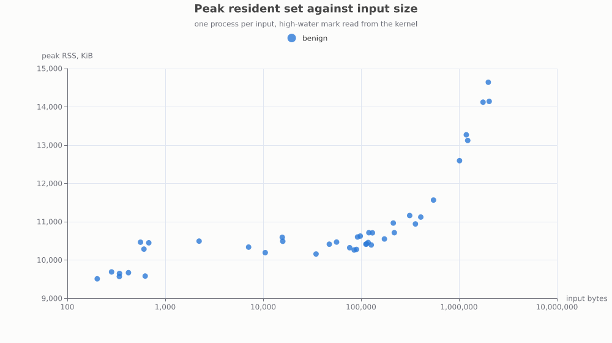

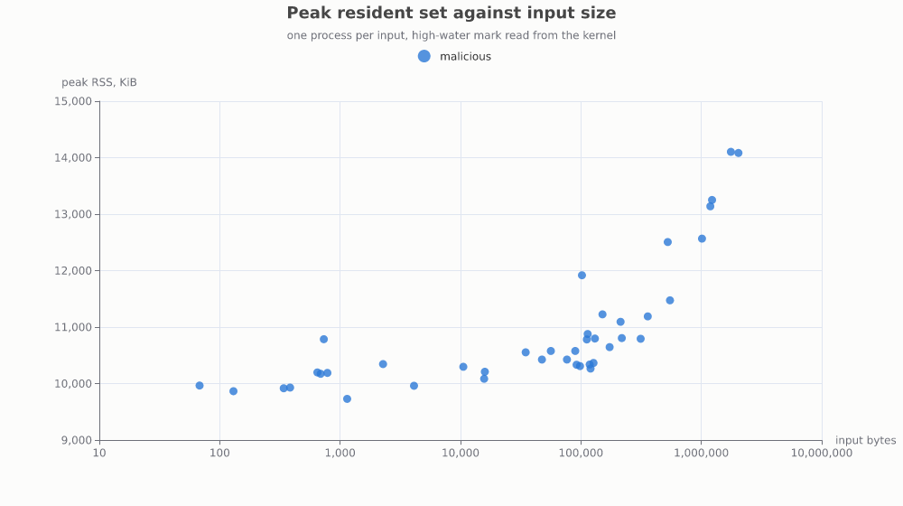

Measured with `cargo xtask memory`, which spawns a fresh process per input and reads the kernel's own RSS for that process .
Peak RSS ranges from roughly 9.5 MiB (smallest inputs) to 14.5 MiB (largest, ~2 MiB inputs) across both sets. This growth is modest compared against a nearly four-order-of-magnitude size range, and the shape is consistent with a largely fixed per-process baseline.

## 5.5 Scenario evaluation

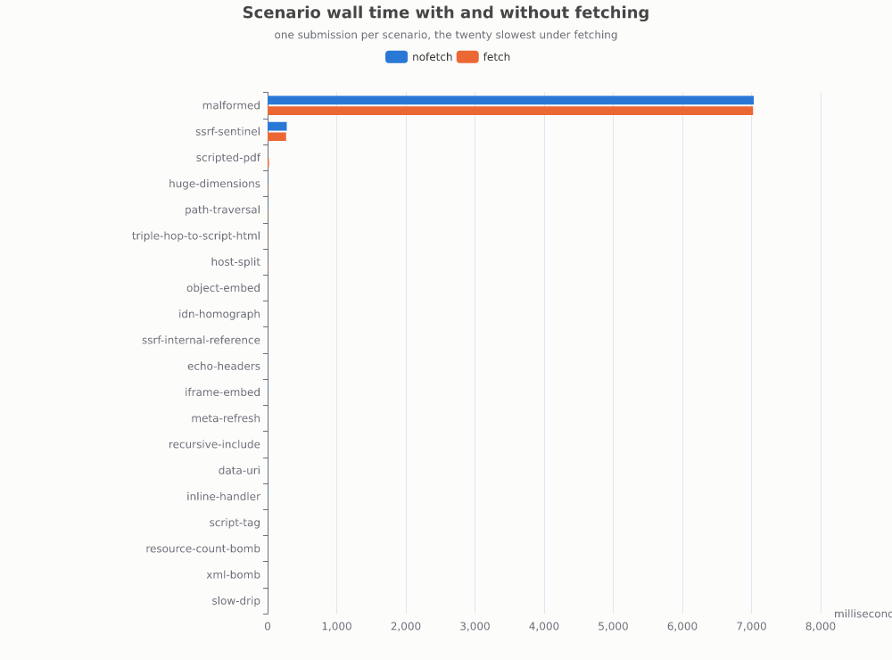

One result here stands out: **the `malformed` scenario takes roughly 7 seconds in both fetching and non-fetching mode.**
`max_time_ms` is only ever checked inside the sub-resource-fetch loop: Acquire, Sniff, Route, and Sanitise never consult a deadline themselves.
The rest of the scenarios (aside from `ssrf-sentinel` and the fetch enabled `scripted-pdf`) are not even visible, taking less than 1/10 of a second to process.
The much longer duration of malformed is probably due to the sanitiser handling malformed inputs similarly as exceptions, thus incurring into timeouts in order to resolve the sanitisation.

## 5.6 Summary

| Axis | Spec requirement | Result |
| --- | --- | --- |
| Correctness | Detection/false-positive rate on a labelled corpus | **90.2% overall** (37/41); 8/10 categories at 100%, `css` (60%) and `xss` (84.6%) below |
| Performance | Throughput/latency vs. input size | Close to linear on a log-log plot; fetching adds 2-3 orders of magnitude of latency at matched size |
| Scalability | Speed-up curves vs. worker count | Sub-linear past 2 workers on both sets; fetch scales better than no-fetch past 6-8 workers, plausibly from I/O-wait overlap |
| Resource usage | Peak memory vs. zero-copy design | 9.5-14.5 MiB across the corpus's size range; growth present but modest, and hard to separate from fixed per-process baseline |
